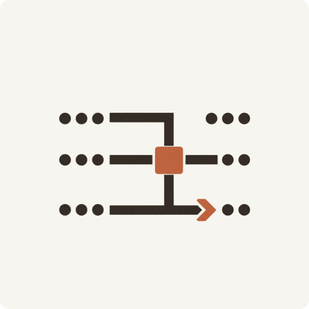

# 亥一 / Yee

**研究能源系统。构建工具，记录 AI。**

上海交通大学在读研究生，关注物理约束下的智能决策。这里放正在维护的设计规范、桌面工具、工业视觉软件与 GPU 调度研究。

[个人网站 ↗](https://haiyi-yee.pages.dev) · [在抖音找到我 ↗](https://www.douyin.com/search/%E4%BA%A5%E4%B8%80)

## 设计与工具

<h3><a href="https://github.com/Hai-qq/humanist-frontend"> Humanist · 界面设计札记</a></h3>

从 Anthropic 与 Kimi 的公开设计实践中提炼方法，整理成可阅读的规范与编码 Agent 可调用的 Skill。

设计规范 · Agent Skill · v0.3.0

---

<h3><a href="https://github.com/Hai-qq/Interlude"> 间歇 · Interlude</a></h3>

一只胖雀，通过菜单栏和小窗提醒你离开屏幕片刻。主要支持 macOS，在本地运行。

桌面应用 · macOS · 源码分发

---

<h3><a href="https://github.com/Hai-qq/visual-inspection-test-deployment"> Visual Inspection</a></h3>

为 Windows 检测工位配置、执行与交付测试序列，支持受支持的 ONNX 检测、规则判定与记录追溯。

工业视觉 · C# / WPF · ONNX

---

<h3><a href="https://github.com/Hai-qq/SchedNav"> SchedNav</a></h3>

在历史 GPU 任务记录上比较调度策略。Agent 提出有边界的建议，由确定性仿真与 SLO 审计验证。

GPU 调度 · 离线研究 · 尚未接入真实集群

## 使用与交流

安装方式、支持范围和验证结果见各项目 README。遇到问题或有改进建议，欢迎在对应仓库开 Issue。SchedNav 当前是离线研究工具，不代表已部署到真实集群或证明了性能优势。

更多内容与研究记录，见 [个人网站](https://haiyi-yee.pages.dev)。
